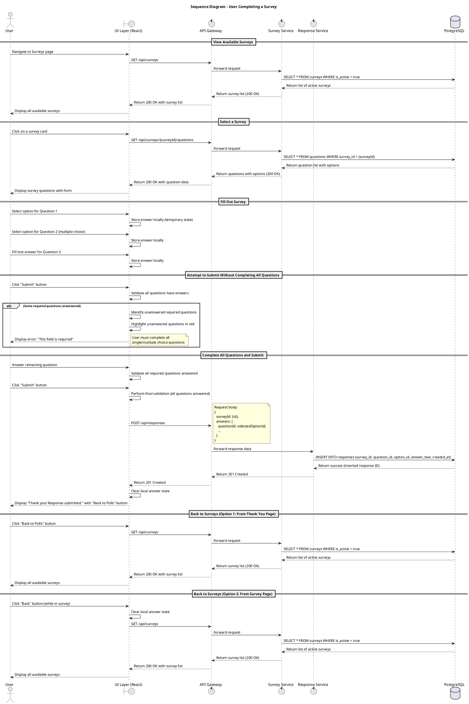

# Architecture Documentation

## Overview

This document describes the architecture of the Student Union Website, including **static view**, **dynamic view**, and ****deployment view.

## Static View

### Component Diagram

### What the Diagram Shows

### Coupling and Cohesion

### Maintainability Implications

**Strengths:**

**Constraints:**

### Quality Requirements Supported or Constrained

**Supported:**

**Constrained:**

## Dynamic View

### Sequence Diagrams

**Survey Participation Flow**: The diagram show full sequence of users interactions with 'Polls' page and surveys.

**Importance**: Surveys are created by admins and serves as the channel between students and SU members. With surveys on the public webpage it will be easier to collect feedback and to export it forward as diagrams.

**Architecture decisions, integration boundaries, quality requirements**:

- Client-side validation of unanswered questions provides immediate feedback, reduces server load and improves user experience
- QR-5: Text on page does not slide when user change the language during the survey
- QR-6: A student fills out and submits a questionnaire, then answers are given to backend, user sees confirmation.

**Diagram helps to understand** what system of Polls page approximately looks like inside, how it handles situation where user did not fill the form fully (ignored 'prepared choice questions'), how it saves the given answers.

## Deployment View

### Deployment Diagram

### Infrastructure Overview

[Explain deployment nodes and environments]

### Environment Configuration
- **Development**: [Configured for local testing]
- **Staging**: [Mirrors production]
- **Production**: [Live deployment]

### Scaling Considerations
[Discuss scaling approach and limitations]

## Architecture Decisions
For detailed decisions, see the Architecture Decision Records (ADRs) in `docs/architecture/adr/`.

## Revision History
| Date | Version | Changes | Author | Related ADR |
|------|---------|---------|--------| --------|
| 2026-06-30 | 1.0 | Initial architecture documentation | bilidjinka | - |
