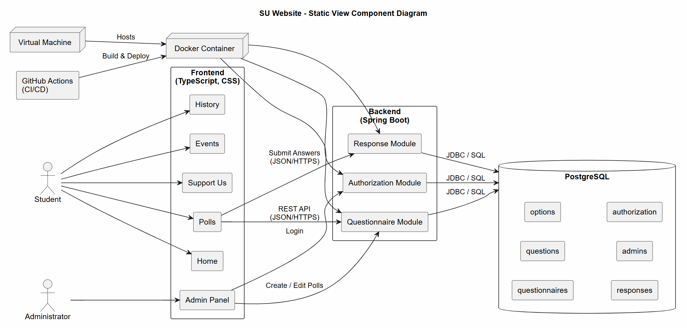

# Architecture Documentation

## Overview

This document describes the architecture of the Student Union Website, including **static view**, **dynamic view**, and ****deployment view.

## Static View

### Component Diagram

Source (PlantUML): [static-component-diagram.puml](static-view/component-diagram.puml)

### What the Diagram Shows

The component diagram shows the static architecture of the Student Union Website and illustrates the main software components, external actors, infrastructure, and communication paths between them.

The frontend consists of several functional components, including Home, History, Events, Polls, Support Us, and the Admin Panel. Most pages currently serve static content, while the Polls and Admin Panel components communicate with the backend through a REST API using HTTPS and JSON.

The backend is organized into three main functional modules responsible for questionnaire management, administrator authorization, and response processing. These modules interact with a PostgreSQL database that stores questionnaires, questions, options, responses, and administrator credentials.

The diagram also shows the deployment environment, where the backend and database are hosted inside Docker containers running on a virtual machine. GitHub Actions is used as the CI/CD platform for automated build and deployment.

### Coupling and Cohesion

The architecture follows a layered design with separation between the presentation layer, backend services, and persistence layer.

Communication between the frontend and backend is performed through REST APIs, resulting in low coupling between client and server implementations. Backend modules are responsible for distinct areas of functionality, providing high cohesion by keeping related responsibilities together.

The database is accessed only by backend modules, preventing direct dependencies between the frontend and persistence layer.

### Maintainability Implications

**Strengths:**

- Clear separation of frontend, backend, and database responsibilities.
- Modular backend structure simplifies future feature development.
- REST-based communication allows frontend and backend to evolve independently.
- Dockerized deployment improves portability and reproducibility across environments.
- Functional modules can be extended with minimal impact on unrelated parts of the system.

**Constraints:**

- Several frontend pages currently contain static content and will require backend integration as functionality grows (events page).
- The backend is deployed as a single application, limiting scalability and fault tolerance.
- Database access is centralized in a single PostgreSQL instance, creating a potential single point of failure.

### Quality Requirements Supported or Constrained

### Quality Requirements Supported or Constrained

**Supported:**

- **QR-1 – Maintainability (Code Consistency):** The separation between frontend, backend, and persistence layers simplifies development and maintenance. The modular architecture, together with automated CI checks, helps developers modify the codebase while preserving consistency and reducing integration issues.
- **QR-2 – Reliability (Build Stability):** The use of GitHub Actions together with a clearly separated project structure supports automated builds and continuous verification of the application before deployment.
- **QR-6 – Functional Suitability (Questionnaire Submission):** The dedicated Questionnaire, Response, and Authorization backend modules provide a clear separation of responsibilities, making questionnaire processing easier to implement, test, and maintain.

**Constrained:**

- **QR-3 – Performance Efficiency (Bundle Size):** As additional frontend pages and features are introduced, the application bundle may continue to grow. The current architecture does not yet include techniques such as code splitting or lazy loading to minimize bundle size.
- **QR-4 – Usability (Mobile Responsiveness):** While the frontend is designed to support responsive layouts, maintaining responsiveness across all pages will require continuous development and testing as new UI components are added.
- **QR-5 – Usability (Language Switching):** The centralized translation mechanism supports multilingual content, but every newly added page and UI element must be integrated with the translation system to ensure complete language coverage.

## Dynamic View

### Survey Participation Flow

 **The diagram show full sequence of users interactions with 'Polls' page and surveys.**

**Importance**: Surveys are created by admins and serves as the channel between students and SU members. With surveys on the public webpage it will be easier to collect feedback and to export it forward as diagrams.

**Architecture decisions, integration boundaries, quality requirements**:

- Client-side validation of unanswered questions provides immediate feedback, reduces server load and improves user experience
- QR-5: Text on page does not slide when user change the language during the survey
- QR-6: A student fills out and submits a questionnaire, then answers are given to backend, user sees confirmation.

#### Sequence Digram

[Dynamic View diagram-as-code](https://github.com/plaksiki/SU-Website/blob/main/docs/architecture/dynamic-view/user-survey-sequence.puml)

**Diagram helps to understand** what system of Polls page approximately looks like inside, how it handles situation where user did not fill the form fully (ignored 'prepared choice questions'), how it saves the given answers.

## Deployment View

### Deployment Diagram

[Deployment View diagram-as-code](https://github.com/plaksiki/SU-Website/blob/architecture-documentation/docs/architecture/deployment-view/deployment-diagram.puml)

### What the Diagram Shows

The deployment diagram illustrates the runtime structure of the IU Student Union Portal. The system runs on a single Innopolis University virtual machine (10.93.26.192) using Docker containers connected through an internal Docker network:

- **su-frontend** - nginx serving the static React + TypeScript build on port 80. This is the customer-facing entry point for both students and admins.
- **su-backend** - Spring Boot REST API running on port 8080. Handles business logic, JWT authentication, and questionnaire management.
- **su-db** - PostgreSQL database on port 5432 (internal only, not exposed to the outside). Stores questionnaires, questions, options, responses, and admin accounts.
- **GitHub Actions** - external CI/CD pipeline that automatically builds and validates the code on every push to main.

### Why the Selected Deployment Model Was Chosen

Docker Compose on a single VM was chosen because:
- The team is small (6 people, first-year students) and a single VM is sufficient for the current load
- Docker Compose allows running all services with one command which simplifies deployment for the whole team
- The university provides a VM which removes the need to manage cloud infrastructure
- Containerization ensures the same environment on all team members' machines and on the server

### How the Current Deployment Supports or Constrains the Product

**Supports:**
- Fast iteration - any team member can deploy a new version by running `docker compose -f docker-compose.prod.yml up -d --build`
- Isolation - frontend, backend, and database run in separate containers and do not interfere with each other
- CI/CD - GitHub Actions automatically checks code quality before it reaches production

**Constrains:**
- Single point of failure - if the VM goes down, the entire portal is unavailable
- No horizontal scaling - a single VM cannot handle very high traffic
- Redis and Thumbor (image optimizer) are planned but not yet deployed — image optimization is not available in the current version

### What Must Be Considered When Deploying or Operating for the Customer

- Environment variables (DB credentials, JWT secret) must be set in a `.env` file on the VM - never committed to the repository
- PostgreSQL data is stored in a Docker volume - before any VM maintenance, the database must be backed up
- The frontend proxies API calls to the backend - if the backend container is down, the polls and admin panel will not work
- After deploying a new version, run `docker compose -f docker-compose.prod.yml up -d --build` on the VM to apply changes

### Infrastructure Overview
The portal runs on a single Innopolis University VM (Ubuntu, 10.93.26.192).
All services are containerized using Docker and managed via Docker Compose.
CI/CD is handled by GitHub Actions which runs linting, tests, and build
checks on every pull request.

### Environment Configuration
- **Development**: Local machine - `npm run dev` for frontend, backend runs locally
- **Production**: Innopolis University VM — `docker-compose.prod.yml`

### Scaling Considerations
The current single-VM deployment is sufficient for the IU student audience
(approximately 1000 students). Horizontal scaling is not planned for the
current semester. Redis caching and Thumbor image optimization are planned
for future sprints to improve performance under higher load.

## Architecture Decisions
For detailed decisions, see the Architecture Decision Records (ADRs) in `docs/architecture/adr/`.

## Revision History
| Date | Version | Changes | Author | Related ADR |
|------|---------|---------|--------| --------|
| 2026-06-30 | 1.0 | Initial architecture documentation | bilidjinka | - |
