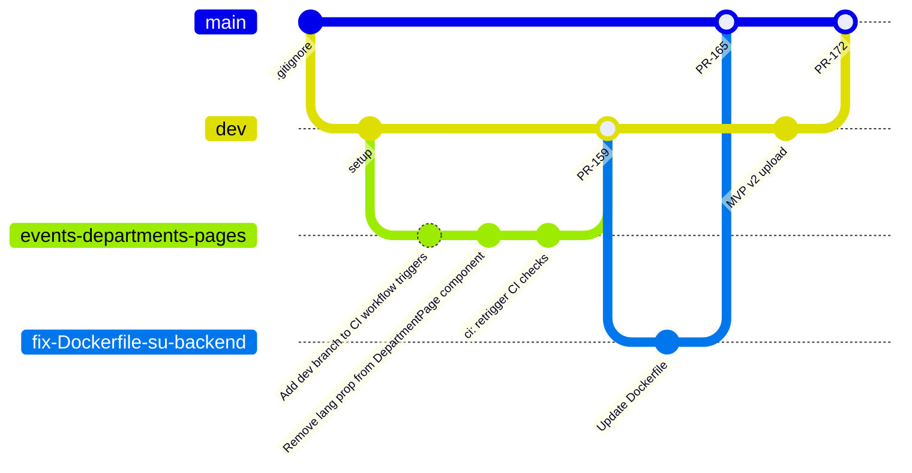

# Development Process

## Table of Contents

- [Development Process](#development-process)
  - [Table of Contents](#table-of-contents)
  - [Boards and Views](#boards-and-views)
  - [Git Workflow](#git-workflow)
    - [GitGraph Diagram](#gitgraph-diagram)
    - [Creating Issues](#creating-issues)
    - [Closing Issues](#closing-issues)
      - [Types of an Issue template presented](#types-of-an-issue-template-presented)
    - [Branching Strategy](#branching-strategy)
    - [PRs and MRs](#prs-and-mrs)
    - [Review](#review)
    - [Changes merging](#changes-merging)
  - [Configuration and Secrets Management](#configuration-and-secrets-management)
    - [Secrets Storage](#secrets-storage)
    - [Configuration Examples](#configuration-examples)
    - [Runtime Configuration](#runtime-configuration)
      - [Backend (Spring Boot)](#backend-spring-boot)
      - [CI](#ci)
      - [CD](#cd)
        - [Process](#process)
  - [Reproducible Development Environment](#reproducible-development-environment)
    - [Prerequisites](#prerequisites)

## Boards and Views

The team uses [GitHub Projects](https://github.com/plaksiki/SU-Website/projects) to manage the Product Backlog and Sprint Backlogs with the following columns:

| Column | Entry Criteria |
|--------|---------------|
| TO DO | Draft issues (not fully described, without assignee, not assigned) |
| Ready | Assigned issues with full description |
| In Progress | Assignee started to work on issue |
| In Review | PR request closing the issue is created and wating for approval |
| Done | PR request closing to the issue is approved and merged to dev/main/architecture-documentation branches |

## Git Workflow

### GitGraph Diagram

### Creating Issues

Issues contain:

- Related Issues (if there are any)
- Issue Type
- Description
- Completion Criteria

Every issue is assigned to the team member(s) and have labels and project(s). If an issue is focused on MVP features, it also has its sprint milestone.

### Closing Issues

Issues are closed when:

- All other issues it depends on closed
- All criterias are considered
- (If it is a part of any Backlog) PR closing it is moved to the "Done" section in its Backlog

#### Types of an Issue template presented

    1. **User Story** - Describe a new feature from user's side
    2. **Task/PBI** - Course Task or Product Backlog Item
    3. **Bug Report** - Report about any bugs

### Branching Strategy

- `main` - production-ready code
- `dev` - integration product branch
- `[# of issue]-issue-description` - branch where some issue is solving
- `changes-description` - for any task/documentation that does not have an issue or fast fixes/updates

### PRs and MRs

- [PR template](https://github.com/plaksiki/SU-Website/blob/main/.github/pull_request_template.md)

Changes in `dev` and `main` from other branches are submitted throug PRs. PRs author link it to issues (if there are any), summarize changes are made, testing that was performed, write acceptance criteria, mark changelog section (and change `CHANGELOG.md` if needed).

### Review

**Comment-review is performed if:**

- It was requested by its author to check structure or the work was done, so detailed feedback is given
- Any mistakes/bugs are detected, or there are ideas how to improve something

### Changes merging

1. Product code is merged from `dev` to `main` after it was tested and verified
2. Documentation/assignment task are preferably merged into `main` when some block of work/tasks is done (whole assignment documentation, architecture documentation section)
3. Fast merge of small changes/structure fixes to the `main` immediately after PR is approved
4. Merging to `dev` and `main` only after PR is approved, on other branches no approve is needed

## Configuration and Secrets Management

### Secrets Storage

- [List of files remain ignored](https://github.com/plaksiki/SU-Website/blob/architecture-documentation/.gitignore)
  
### Configuration Examples

- `.env.example` - sanitized environment variables
- `application.example.yml` - sanitized Spring Boot config

### Runtime Configuration

#### Backend (Spring Boot)

- **Primary Source:** `application.properties` file located in `su-backend/backend/demo/src/main/resources/`
- **Environment Overrides:** Environment variables are used to override properties in different environments
- **Secrets:** Sensitive values (passwords, API keys, JWT secrets) are **never** hardcoded. They are injected via environment variables at runtime

#### CI

We use GitHub Actions. CI runs on every push and PR, running tests and linters. Workflow files are stored in `.github/workflows/`.

#### CD

**The project uses a cron-based CD pipeline:**

- [update.sh](https://github.com/plaksiki/SU-Website/blob/main/update.sh)

##### Process

1. `update.sh` script is executed
2. Pulls latest code from `main` branch
3. Rebuilds the application
4. Restarts services
5. Clean old images

## Reproducible Development Environment

### Prerequisites

- **JDK 17** (or later)
- **Node.js 22.x** (or later)
- **PostgreSQL 16.x**
- **Git**

**Follow Deployment instructions:** [DEPLOY.md](https://github.com/plaksiki/SU-Website/blob/main/DEPLOY.md)
