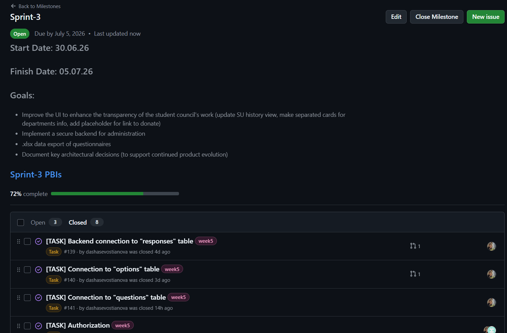
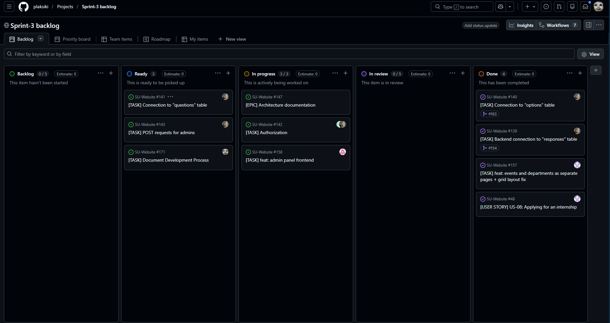
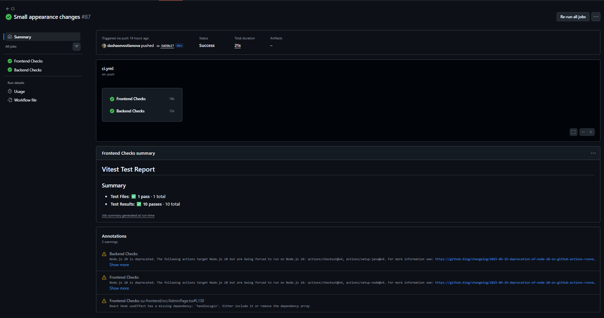
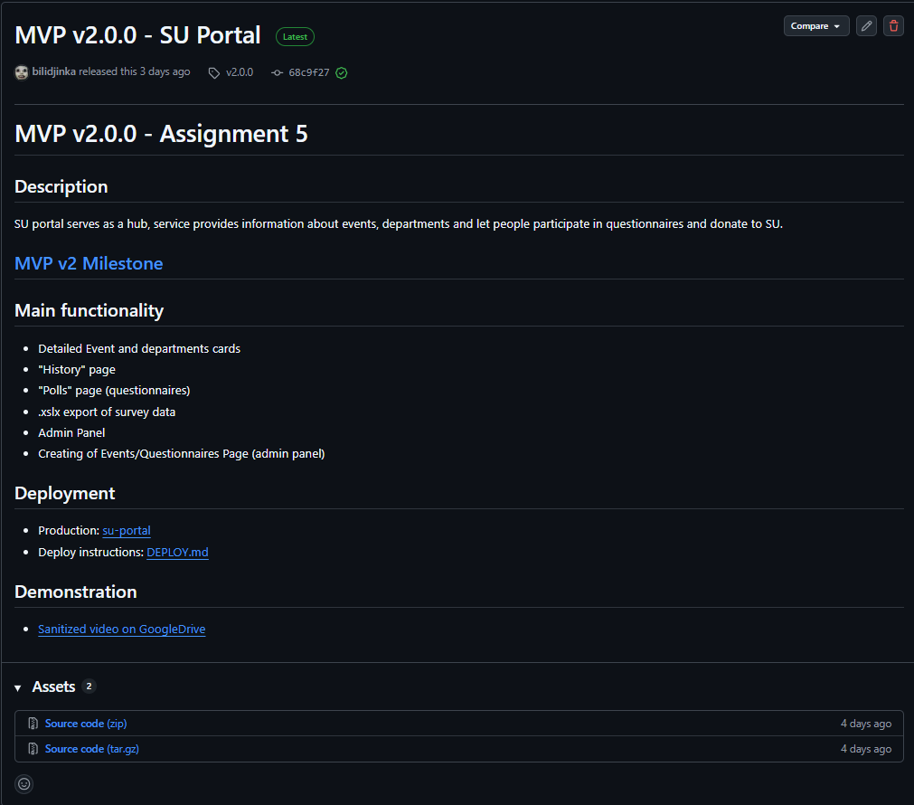
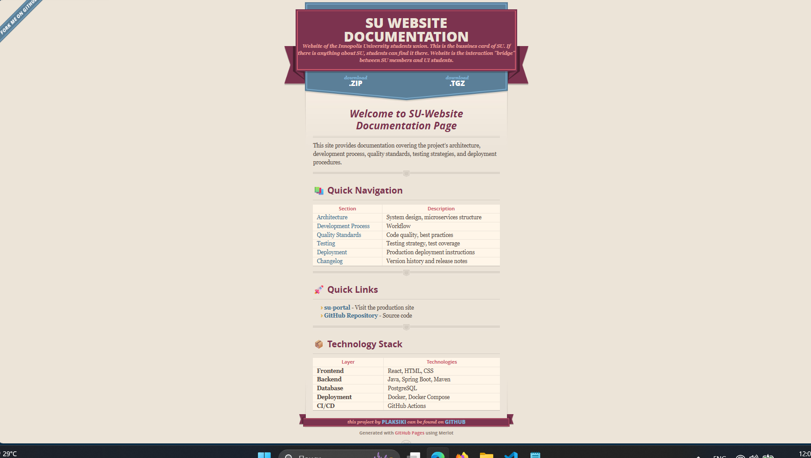

# Week 5 Report

## Project Information
- **Project name:** SU Website
- **Description:** The Innopolis University Student Union Portal is a centralized web platform designed to connect IU students with the SU team. Serving as a hub, service provides information about events, departments and let people leave their feedback and donate to SU.
- **License:** [MIT License](https://github.com/plaksiki/SU-Website/blob/main/LICENSE)

---

## Backlog & Sprint Managment
### Product Backlog
- **[Product Backlog Board](https://github.com/orgs/plaksiki/projects/2)**
- **Total Size:**  Story Points

### Current Sprint
- **[Sprint-3 Backlog Board](https://github.com/orgs/plaksiki/projects/12)**
- **[Sprint-3 Milestone](https://github.com/plaksiki/SU-Website/milestone/3)**
- **Sprint-3 Goal:** Implement Admins authorization and .xlsx export of questionnaires data
- **Sprint-3 Dates:** 2026-06-30 – 2026-07-05
- **Total Sprint-3 Size:** 33 Story Points

### Selected Scope for Current Sprint
The selected scope includes:
- Admin panel
- Export .xlsx data of questionnaires
- History page
- Update UI (Detailed events and department cards, donate link placeholder)

## Delivered MVP v2 Changes
- ✅ Questionnire participation flow
- ✅ Support for three question types: single choice, multiple choice, text input
- ✅ Navigation between survey list and question form
- ✅ Architecture documentation with ADRs

---

## Product Access Artifact
[su-portal](https://10.93.26.192)

---

## Access / Run Instructions
[DEPLOY.md](https://github.com/plaksiki/SU-Website/blob/main/DEPLOY.md)

---

## Customer Feedback Response Table

| Feedback point | Resulting PBI or issue | Status | Response |
|---|---|---|---|
| Simplified Donation page | [#47](https://github.com/plaksiki/SU-Website/issues/47) | Done | Left only QR-code and link |
| Backlog for admins | - | Deffered | Deferred because MVP v2 prioritized creating an admin panel with ability to create questionnaires |
| Support for .xlsx import of data| [#45](https://github.com/plaksiki/SU-Website/issues/45) | ✅ Done |  |
| Dark Theme | [#162](https://github.com/plaksiki/SU-Website/issues/162) | ✅ Done | Deffered to next sprint |

---

## Documentation Links

| Document | Link |
|----------|------|
| Roadmap | [docs/roadmap.md](https://github.com/plaksiki/SU-Website/blob/main/docs/roadmap.md) |
| Definition of Done | [docs/definition-of-done.md](https://github.com/plaksiki/SU-Website/blob/main/docs/definition-of-done.md) |
| Testing Strategy | [docs/testing.md](https://github.com/plaksiki/SU-Website/blob/main/docs/testing.md) |
| Quality Requirements | [docs/quality-requirements.md](https://github.com/plaksiki/SU-Website/blob/main/docs/quality-requirements.md) |
| Quality Requirement Tests | [docs/quality-requirement-tests.md](https://github.com/plaksiki/SU-Website/blob/main/docs/quality-requirement-tests.md) |
| User Acceptance Tests | [docs/user-acceptance-tests.md](https://github.com/plaksiki/SU-Website/blob/main/docs/user-acceptance-tests.md) |
| Development Process | [docs/development-process.md](https://github.com/plaksiki/SU-Website/blob/main/docs/development-process.md) |
| Architecture Overview | [docs/architecture/README.md](https://github.com/plaksiki/SU-Website/blob/main/docs/architecture/README.md) |

---

## Architecture Artifacts

| Artifact | Link |
|----------|------|
| Static View | [docs/architecture/static-view/](https://github.com/plaksiki/SU-Website/blob/main/docs/architecture/static-view/) |
| Dynamic View | [docs/architecture/dynamic-view/](https://github.com/plaksiki/SU-Website/blob/main/docs/architecture/dynamic-view/) |
| Deployment View | [docs/architecture/deployment-view/](https://github.com/plaksiki/SU-Website/blob/main/docs/architecture/deployment-view/) |
| ADR Index | [docs/architecture/adr/](https://github.com/plaksiki/SU-Website/blob/main/docs/architecture/adr/) |

---

## Architecture Summary

The system follows a **microservices-oriented architecture** with clear separation of concerns:

- **Frontend (React)**: Provides the user interface for survey participation and administration. Communicates with backend via REST API.
- **Backend (Spring Boot)**: Acts as the core orchestrator for survey operations. It is a connecting port between database and frontend. Frontend sends questionnaires results to backend, and finally backend form it for database tables.
- **Database (PostgreSQL)**: Stores surveys, questions, and student responses.
- **Supporting Services**: Nginx serves the React frontend, acting as a single entry point for all users. Docker contaibers are essential for our project to package the frontend, backend, and database into isolated but network-connected "boxes" that work identically on any server, communicating with each other.

**How Architecture Supports the Product:**
- **Scalability**: Microservices can be scaled independently based on load.
- **Maintainability**: Clear separation between frontend, business logic, and data storage.
- **Reliability**: Transaction-based persistence ensures data consistency for survey responses.
- **Extensibility**: New question types or survey features can be added without major refactoring.

---

## Quality Requirements → Architecture Mapping

| Quality Requirement | How Architecture Addresses It |
|---------------------|-------------------------------|
| **Data Integrity (QR-003)** | Transaction management (BEGIN/COMMIT/ROLLBACK) ensures atomic save operations |
| **Security (QR-004)** | Server-side validation protects against malicious input; separated validation layer |
| **Usability (QR-005)** | Clear feedback on success/error; intuitive navigation with "Back" button |
| **Performance (QR-001)** | Independent services allow horizontal scaling; caching layer (Redis) available |
| **Reliability (QR-002)** | Health checks, graceful error handling, and container orchestration via Docker Compose |

**Related ADRs:**
- [ADR-001: Database Choice (PostgreSQL)](../../docs/architecture/adr/ADR-001-database-choice.md)
- [ADR-002: Transaction Management Strategy](../../docs/architecture/adr/ADR-002-transaction-management.md)
- [ADR-003: API Design Approach](../../docs/architecture/adr/ADR-003-api-design.md)

---

## Testing & CI Status

| Aspect | Status |
|--------|--------|
| **Unit Tests** | [ВСТАВИТЬ статус, например: 85% coverage, all passing] |
| **Integration Tests** | [ВСТАВИТЬ статус, например: 5/5 passing] |
| **UAT Tests** | [ВСТАВИТЬ статус, например: 8/10 passing, 2 pending] |
| **CI Pipeline** | ✅ Passing (latest build: #123) |
| **Protected Branch** | ✅ All checks passed |

---

## CI/CD Links

| Link | URL |
|------|-----|
| CI Pipeline Configuration | [ВСТАВИТЬ ссылку на .gitlab-ci.yml или .github/workflows] |
| Latest CI Run (Protected Branch) | [ВСТАВИТЬ ссылку на последний успешный CI ран] |
| Latest CI Run (Main Branch) | [ВСТАВИТЬ ссылку] |

---

## Release Artifacts

| Artifact | Link |
|----------|------|
| SemVer Release (MVP v2) | [v2.0.0](https://github.com/plaksiki/SU-Website/releases/tag/v2.0.0) |
| CHANGELOG.md | [CHANGELOG.md](https://github.com/plaksiki/SU-Website/blob/main/CHANGELOG.md) |

---

## Demo Video

📹 **Public Sanitized Demo Video ( < 2 minutes )**
[Demo video]

---

## UAT Results Summary

**Public Sanitized UAT Results Summary:**

**Key Findings:**
- ✅ All question types render correctly
- ✅ Validation prevents empty submissions
- ✅ Transaction-based saving successfully maintains data integrity

---

##  Hosted Documentation Site

---

## Week 5 Reports

| Report | Link |
|--------|------|
| Sprint Review Transcript | [reports/week5/sprint-review-transcript.md](https://github.com/plaksiki/SU-Website/blob/main/reports/week5/sprint-review-transcript.md) |
| Sprint Review Summary | [sprint-review-summary.md](https://github.com/plaksiki/SU-Website/blob/main/reports/week5/sprint-review-summary.md) |
| Reflection | [reflection.md](https://github.com/plaksiki/SU-Website/blob/main/reports/week5/reflection.md) |
| Retrospective | [retrospective.md](https://github.com/plaksiki/SU-Website/blob/main/reports/week5/retrospective.md) |
| LLM Report | [llm-report.md](https://github.com/plaksiki/SU-Website/blob/main/reports/week5/llm-report.md) |

---

## Product Status Summary

**Current Status: MVP v2 - Stable**

- Main page with departments info
- SU History page
- Events page
- User can view detailed event or SU departments info by tapping on the cards
- Students can view available surveys
- Surveys present questions of different types (single/multiple choice, text input) and submit them
- Donation page with QR-code

**Known Issues:**
- In surveys only single choice questions being checked for given answer
- Backlog for admins is not presented
- Thumbor was not implemented

**Health:** ✅ Backend API stable | ✅ Database healthy | ✅ Frontend operational

---

## Next Steps

| Action | Target Sprint |
|--------|---------------||
| Light/Dark Mode Switch | Sprint 4 |
| Admins' Backlog | Sprint 4 |
| Upload real SU photos/info | Sprint 4 OR 5 |

---

## Contribution Traceability

| Team Member | Issues | PRs/MRs | Reviews | Testing | Quality | Automation | Architecture | Documentation |
|-------------|--------|---------|---------|---------|---------|------------|--------------|---------------|
| **Alina P.** | #148, #149, #155 | #,# | 5 reviews | Unit tests | ✅ | - | ADR creation | README update |
| **Bulat S.** | [#150, #157,] | [!47] | 3 reviews | Integration tests | ✅ | CI config | Dynamic view | Reflection |
| **Emil G.** | [#156, #153] | #145 | 6 reviews | - | ✅ | - | - | Sprint summary |
| **Daria S.** | #139, #140 | # | 4 reviews | UAT tests | ✅ | - | Static view | Retrospective |
| **Kristina B.** | #152, #158 | #160, #166 | 6 reviews | - | ✅ | - | - | Sprint summary |
| **Svetlana L.** | [#151, #158, ] | [!49, !50] | 6 reviews | - | ✅ | - | - | Sprint summary |

---

## Screenshots

### Sprint 3 Milestone

### Board / Workflow View

### Latest CI Run (Protected Branch)

### SemVer Release (MVP v2)

### Example Reviewed PR/MR

### Hosted Documentation Site

---