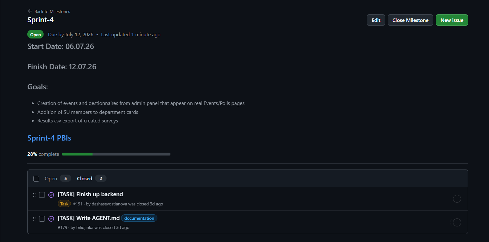
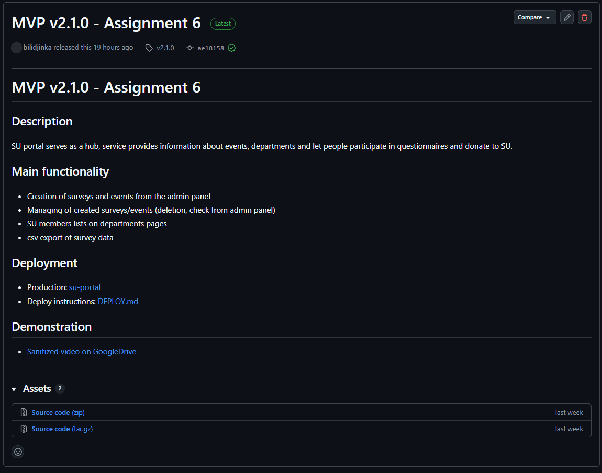
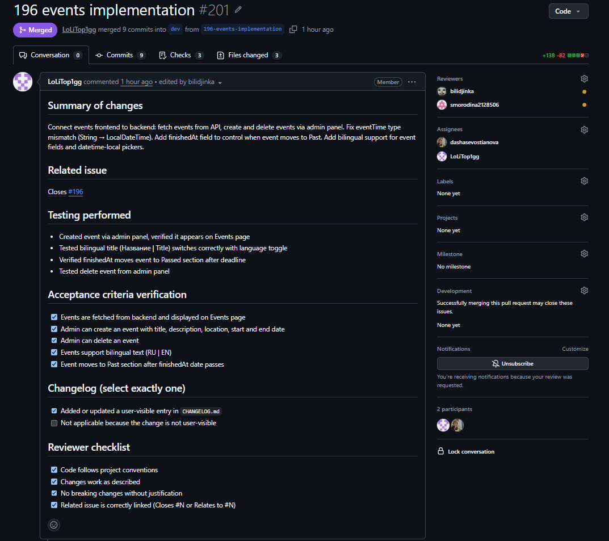

# Week 6 Report

## Project Information

- **Project name:** SU Website
- **Description:** The Innopolis University Student Union Portal is a centralized web platform designed to connect IU students with the SU team. Serving as a hub, service provides information about events, departments and let people leave their feedback and donate to SU.
- **License:** [MIT License](https://github.com/plaksiki/SU-Website/blob/main/LICENSE)

---

## Backlog & Sprint Managment

### Product Backlog

- **[Product Backlog Board](https://github.com/orgs/plaksiki/projects/2)**
- **Total Size:** 110 Story Points

### Current Sprint

- **[Sprint-4 Backlog Board](https://github.com/orgs/plaksiki/projects/16)**
- **[Sprint-4 Milestone](https://github.com/plaksiki/SU-Website/milestone/7)**
- **Sprint-4 Goal:** Connect Frontend with Backend and database, extend product and project documentation.
- **Sprint-4 Dates:** 2026-07-06 – 2026-07-12
- **Total Sprint-4 Size:** 8 Story Points

### Selected Scope for Current Sprint

- Creating questionnaires and Events from admin panel
- csv export of real questionnaires results
- Instructions for AI working in the repository and contributers

## Trial-release Changes

- ✅ Creation of questionnaires from the admin panel
- ✅ Creation of events from the admin panel
- ✅ Management of created items from admin panel
- ✅ Presentation of departments members

---

## Product Access Artifact

[su-portal](https://10.93.26.192/)

---

## Documentation

### Core Documentation

- [README.md](https://github.com/plaksiki/SU-Website/blob/main/README.md)
- [CONTRIBUTING.md](https://github.com/plaksiki/SU-Website/blob/main/CONTRIBUTING.md)
- [AGENTS.md](https://github.com/plaksiki/SU-Website/blob/main/AGENTS.md)
- [docs/customer-handover.md](https://github.com/plaksiki/SU-Website/blob/Assignment/docs/customer-handover.md)
- [DEPLOY.md](https://github.com/plaksiki/SU-Website/blob/main/DEPLOY.md)
- [Hosted Documentation Site](https://plaksiki.github.io/SU-Website/)
- [docs/roadmap.md](https://github.com/plaksiki/SU-Website/blob/main/docs/roadmap.md)

---

## Customer-Facing Documentation Review

A documentation review was conducted with the customer during Week 6. Here are the results:

| **Aspect** | **Customer Feedback** |
| :--- | :--- |
| **Clear** | - |
| **Unclear** | Deployment documentation seems like it is not enough |
| **Missing** | Swagger documentation |

### Action Items from Documentation Review

- Swagger/Open Api documentation: Issue [#62](https://github.com/plaksiki/SU-Website/issues/62)

---

## Transition Readiness

| **Aspect** | **Status** |
| :--- | :--- |
| Handover Documentation | Done |
| Deployment Instructions | Done |

---

## Customer Feedback

### Feedback Response Table

| **Feedback Point** | **Resulting PBI / Issue** | **Status** |
| :--- | :--- | :--- |
| Info cards for SU members | Issue [#197](https://github.com/plaksiki/SU-Website/issues/197) | Done |
| Separate pages in admin panel | Issue [#198](https://github.com/plaksiki/SU-Website/issues/198) | TO DO |
| csv export of only picked questionnaire data | Issue [#199](https://github.com/plaksiki/SU-Website/issues/199) | TO DO |
| Photos of two members are swapped | - | TO DO |
| The logic of log in to the admin panel is implemented on the frontend, which is unsafe | - | TO DO |

### Feedback Not Yet Addressed

- Separate pages in admin panel (deprecated to Week 7)
- Single-item csv export (deprecated to Week 7)
- The logic of log in to admin panel (deprecated to Week 7)

---

## UAT / Customer Trial Results

### Summary

UAT was conducted during the Sprint 4 review. All tests passed, but customers asked pages to pull created items to user's page view simultaneously (not after updating the page).

### Key Findings

- Admin panel supports events creation and show the list of created events
- Admin panel supports questionnaires creation and show the list of created surveys
- After admin logged in it is saved in browser so user do not need to log in again every time if working on the same device
- Events and surveys created from the admin panel

### Issues Found During UAT

- When click on csv export button, results of ALL surveys are downloaded
- Admin panel page is too long and messy
- Website page should be updated to see changes(new events and surveys)
- Admin log in process is happening on frontend

---

## Repository Items Links

| Item | Link |
|------|------|
| **Week 6 SemVer trial release** | [v2.1.0](https://github.com/plaksiki/SU-Website/releases/tag/v2.1.0) |
| Changelog | [CHANGELOG.md](https://github.com/plaksiki/SU-Website/blob/main/CHANGELOG.md) |
| Sprint 4 review transcript | [reports/week6/sprint-review-transcript.md](https://github.com/plaksiki/SU-Website/blob/main/reports/week6/sprint-review-transcript.md) |
| Sprint 4 review summary | [reports/week5/sprint-review-summary.md](https://github.com/plaksiki/SU-Website/blob/main/reports/week5/sprint-review-summary.md) |
| Sprint 4 reflection | [reports/week6/reflection.md](https://github.com/plaksiki/SU-Website/blob/main/reports/week6/reflection.md) |
| Sprint 4 retrospective | [reports/week6/retrospective.md](https://github.com/plaksiki/SU-Website/blob/main/reports/week6/retrospective.md) |
| LLM Report | [reports/week6/llm-report.md](https://github.com/plaksiki/SU-Website/blob/main/reports/week6/llm-report.md) |

---

## Product Status & Week 7 Follow-Up

### Current Product Status

- Admin panel exist and provides access to:
  - Events and surveys creation/management
  - csv export of survey results
- Main page shows departments cards with its members
- Events page contains cards with detailed info about upcoming/passed events
- SU History page exists
- "Donate Us" page shows the payment QR-code
- Language switch button presented
- "Polls" page shows the list of active surveys users can participate in

### Expected Week 7 Follow-Up Work

| **Work Item** | **Description** | **Priority** |
| :--- | :--- | :--- |
| Ability to edit created events/questionnaires | Admins should be able to edit already created items | Medium |
| csv Export of just picked surveys | Results of only one picked questionnaire are exported whitin the csv export session | High |
| Make separate pages for admin panel features | Creation of events, quesstionnaires and pages of created items (events and surveys) should be placed on separated pages/sections | Medium |
| Change adding of questions to the surveys | Change the logic of adding questions in surveys by adding it without clicking additional button or by having more obvious "Save" button | Low |

---

## Contribution Traceability

| **Team Member** | **Issues** | **PRs/MRs** | **Reviews** | **Testing** | **Docs** | **Transition** | **Deployment** |
| :--- | :--- | :--- | :--- | :--- | :--- | :--- | :--- |
| Alina P. | [#192](https://github.com/plaksiki/SU-Website/issues/192) | [#194](https://github.com/plaksiki/SU-Website/pull/194), [#204](https://github.com/plaksiki/SU-Website/pull/204) | 1 | - | CONTRIBUTING.md, README.md for Week 6 | - | - |
| Bulat S | [#178](https://github.com/plaksiki/SU-Website/issues/178) | [#195](https://github.com/plaksiki/SU-Website/pull/195) | - | Local tests/deployment of the dev branch | AGENTS.md, LLM weekly report | - | - |
| Dasha S. | [#191](https://github.com/plaksiki/SU-Website/issues/191), [#196](https://github.com/plaksiki/SU-Website/issues/196) | [#202](https://github.com/plaksiki/SU-Website/pull/202) | 0 | - | Customer Hnadover, architecture static view description | - | - |
| Emil G. | - | - | 1 | - | customer handover | - | - |
| Kristina B. | [#182](https://github.com/plaksiki/SU-Website/issues/182) | [#203](https://github.com/plaksiki/SU-Website/pull/203) | - | - | Week 6 retropective | - | - |
| Svetlana L. | [#185](https://github.com/plaksiki/SU-Website/issues/185) | - | 1 | - | Week 6 Review transcript and summary | - | - |

---

## Embedded Screenshots

### Sprint 4 Milestone

### Week 6 Trial Release

### Example PR/MR with Linked Issue

