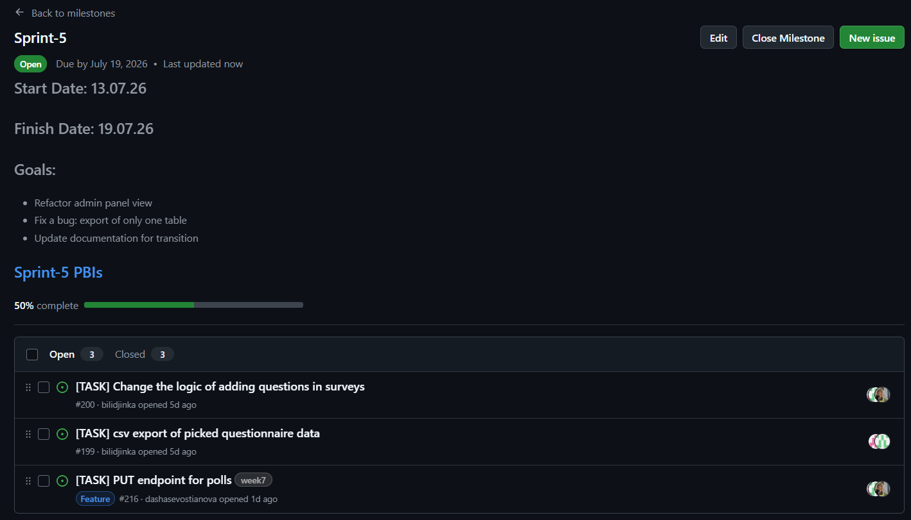
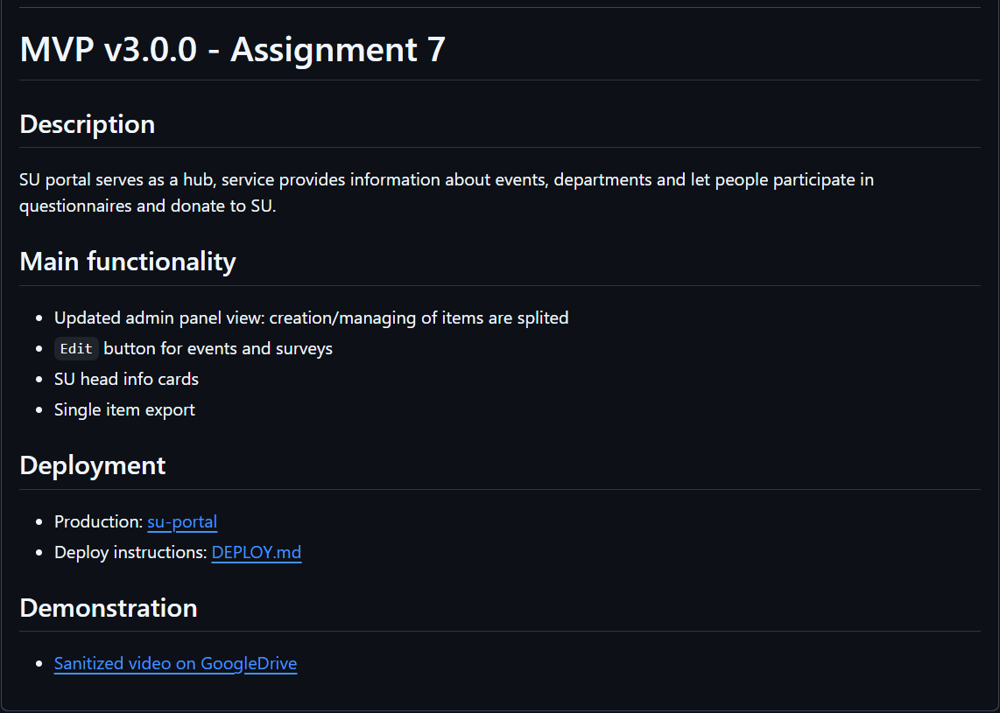
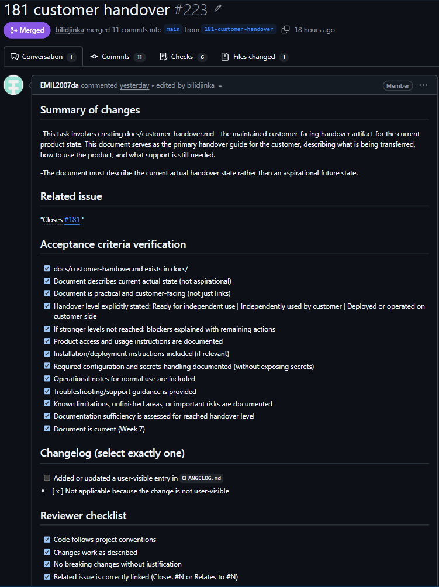

# Week 7 Report

## Project Information

- **Project name:** SU Website
- **Description:** The Innopolis University Student Union Portal is a centralized web platform designed to connect IU students with the SU team. Serving as a hub, service provides information about events, departments and let people leave their feedback and donate to SU.
- **License:** [MIT License](https://github.com/plaksiki/SU-Website/blob/main/LICENSE)

---

## Backlog & Sprint Managment

### Product Backlog

- **[Product Backlog Board](https://github.com/orgs/plaksiki/projects/2)**
- **Total Size:** 110 Story Points

### Current Sprint

- **[Sprint-5 Backlog Board](https://github.com/orgs/plaksiki/projects/18)**
- **[Sprint-5 Milestone](https://github.com/plaksiki/SU-Website/milestone/7)**
- **Sprint-5 Goal:** Admin panel refactoring.
- **Sprint-5 Dates:** 2026-07-13 – 2026-07-19
- **Total Sprint-5 Size:** 8 Story Points

### Selected Scope for Current Sprint

- Separate admin panel on different pages
- csv export of only picked tables
- Thumbor implemetation

## Week 7 maintenance and final `MVP v3` changes

- ✅ Separated pages for admin panel functionality (creating/managing events, surveys)
- ✅ List of departments' members
- ✅
- ✅ Week 7 changes follow up documentation

---

## Product Access Artifact

[su-portal](https://10.93.26.192/)

---

### Core Documentation

- [DEPLOY.md](https://github.com/plaksiki/SU-Website/blob/main/DEPLOY.md)
- [README.md](https://github.com/plaksiki/SU-Website/blob/main/README.md)
- [CONTRIBUTING.md](https://github.com/plaksiki/SU-Website/blob/main/CONTRIBUTING.md)
- [AGENTS.md](https://github.com/plaksiki/SU-Website/blob/main/AGENTS.md)
- [docs/customer-handover.md](https://github.com/plaksiki/SU-Website/blob/Assignment/docs/customer-handover.md)
- [Hosted Documentation Site](https://plaksiki.github.io/SU-Website/)

---

## Final Transition Outcome

### Handover Status

| **Aspect** | **Status** |
| :--- | :--- |
| **Handover Level Reached** | [Full / Partial / Pilot / etc.] |
| **Customer Confirmation Status** | Confirmed |
| **Date of Confirmation** | 18.07.2026 |

### What Was Transferred / Delegated / Made Available

[Provide a summary of what was transferred, delegated, or otherwise made available during the final transition. Reference the current `docs/customer-handover.md` directly.]

### Remaining Transition Blockers, Limitations, or Follow-Up Items

[Explain any remaining transition blockers, limitations, support expectations, or follow-up items identified by the customer.]

| **Item** | **Description** | **Responsible Party** | **Target Resolution** |
| :--- | :--- | :--- | :--- |
| [Item 1] | [Description] | [Who] | [When] |
| [Item 2] | [Description] | [Who] | [When] |

### Customer Independent Use / Deployment / Operation Evidence

[Summarize evidence of customer-independent use, customer-side deployment, or customer-side operation where available.]
At the moment customer does not use or deploy the product, because there is three project to choose among three final products after Demo Day is passed. However, the product readiness is confirmed by the customer.

---

## Customer Feedback & UAT

### Sprint 5 Feedback Response Table

| **Feedback Point** | **Resulting PBI / Issue** | **Status** | **Notes** |
| :--- | :--- | :--- | :--- |
| [Feedback 1] | [Link to PBI/issue] | [Status] | [Notes] |
| [Feedback 2] | [Link to PBI/issue] | [Status] | [Notes] |
| [Feedback 3] | [Link to PBI/issue] | [Status] | [Notes] |

### Week 7 UAT / Customer Trial Results

[Provide a summary of relevant Week 7 UAT or customer-trial results. Include pass/fail rates, critical issues found, and overall customer satisfaction.]

#### Key Findings
- [Finding 1]
- [Finding 2]
- [Finding 3]

#### Issues Found During UAT
- [Issue 1 – with link]
- [Issue 2 – with link]
- [Issue 3 – with link]

---

### Demo Day Preparation

The required Week 7 rehearsal preparation was completed on 2026-07-19.

| **Item** | **Status** | **Notes** |
| :--- | :--- | :--- |
| Presentation Slides | ✅ | We changed some slides from Week 6 Presentation, including Qulity Requirements and Vision Pages |
| Demo Script | ✅ | We distributed speech between all team members in such way that every person speak about stuff he used to work with or understand deeply |
| Rehearsal | ✅ | Rehearsal was conducted on 2026-07-19. All team members were presented. First two times we tried to present with the script, after that had three tries without the script. We were in time during all tries and also had extra time left. |
| Product Demo Video | ✅ | The final vesrion Product video was recorded after Sprint 5 changes were deployed. |

---

## Repository Items Links

| Item | Link |
|------|------|
| **Week 7 SemVer final release** | [v3.0.0](https://github.com/plaksiki/SU-Website/releases/tag/v3.0.0) |
| Changelog | [CHANGELOG.md](https://github.com/plaksiki/SU-Website/blob/main/CHANGELOG.md) |
| Sprint 5 review transcript | [reports/week7/sprint-review-transcript.md](https://github.com/plaksiki/SU-Website/blob/main/reports/week7/sprint-review-transcript.md) |
| Sprint 5 review summary | [reports/week7/sprint-review-summary.md](https://github.com/plaksiki/SU-Website/blob/main/reports/week7/sprint-review-summary.md) |
| Sprint 5 reflection | [reports/week7/reflection.md](https://github.com/plaksiki/SU-Website/blob/main/reports/week7/reflection.md) |
| Sprint 5 retrospective | [reports/week7/retrospective.md](https://github.com/plaksiki/SU-Website/blob/main/reports/week7/retrospective.md) |
| LLM Report | [reports/week7/llm-report.md](https://github.com/plaksiki/SU-Website/blob/main/reports/week7/llm-report.md) |

---

## Final Product Status

### Summary

[Provide a comprehensive summary of the final product status at the end of Sprint 5. Describe what works, what doesn't, overall quality level, and whether the product meets the Definition of Done and customer expectations.]

### Key Achievements

- Intuitive pages navigaton
- Splited interface: no need long scrolling, different functionality and information panels were splited
- Mobile Responsiveness: Website render correctly on mobile devices([QR-4](https://github.com/plaksiki/SU-Website/blob/main/docs/quality-requirements.md#qr-4-usability--mobile-responsiveness) completes)
- Language switching does not slide/glitch the text on page
- Creation of items is available only for admins

### Known Limitations / Open Issues

- 

---

## Contribution Traceability

| **Team Member** | **Issues** | **PRs/MRs** | **Reviews** | **Testing** | **Docs** | **Transition** | **Deployment** | **Demo Day prep** |
| :--- | :--- | :--- | :--- | :--- | :--- | :--- | :--- | :--- |
| Alina P. | [#192](https://github.com/plaksiki/SU-Website/issues/192) | [#194](https://github.com/plaksiki/SU-Website/pull/194), [#204](https://github.com/plaksiki/SU-Website/pull/204) | 1 | - | customer handover update, README.md for Week 7, existing documentation update | - | - | Speech distribution |
| Bulat S | [#178](https://github.com/plaksiki/SU-Website/issues/178) | [#195](https://github.com/plaksiki/SU-Website/pull/195) | - | Local tests/deployment of the dev branch | LLM report | - | - | Presentation update |
| Dasha S. | [#191](https://github.com/plaksiki/SU-Website/issues/191), [#196](https://github.com/plaksiki/SU-Website/issues/196) | [#202](https://github.com/plaksiki/SU-Website/pull/202) | - | - | - | - | - | - |
| Emil G. | - | - | - | - | Week 7 reflection | - | - | - |
| Kristina B. | [#182](https://github.com/plaksiki/SU-Website/issues/182) | [#203](https://github.com/plaksiki/SU-Website/pull/203) | - | - | Week 7 retropective | - | - | - |
| Svetlana L. | [#185](https://github.com/plaksiki/SU-Website/issues/185) | - | - | - | Week 7 Review transcript and summary | - | - | - |

---

## Embedded Screenshots

### Sprint 5 Milestone

### Final Release MVP v3

### Example PR/MR with Linked Issue

